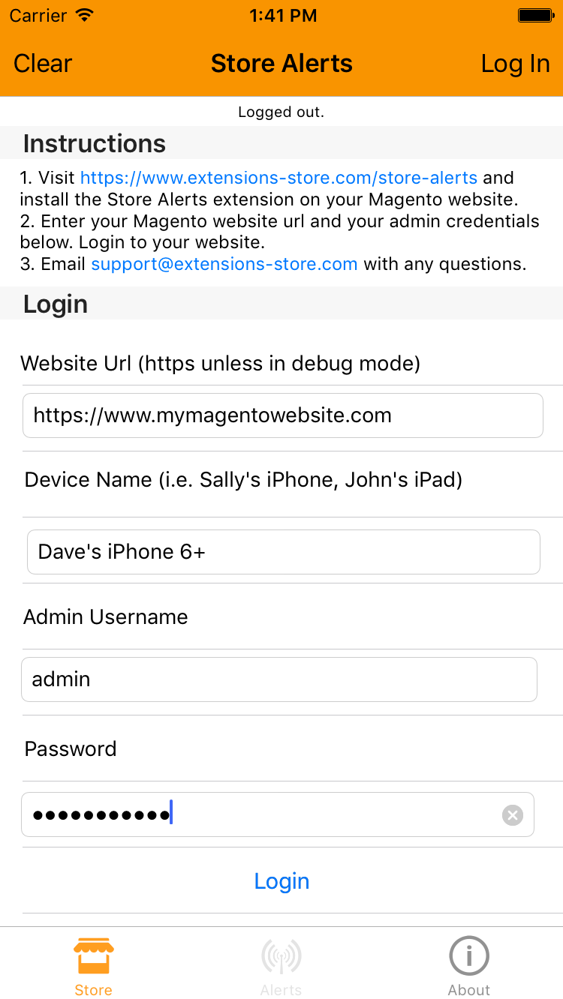
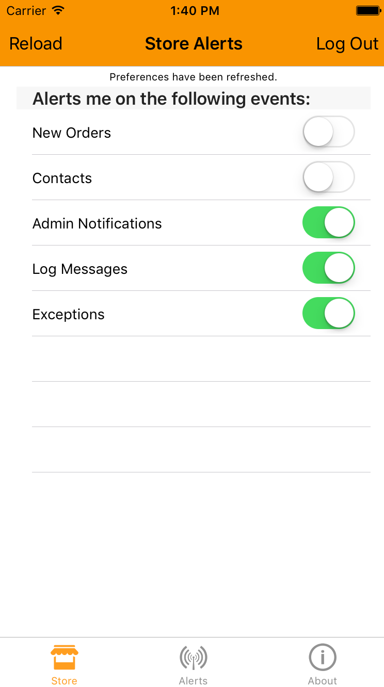
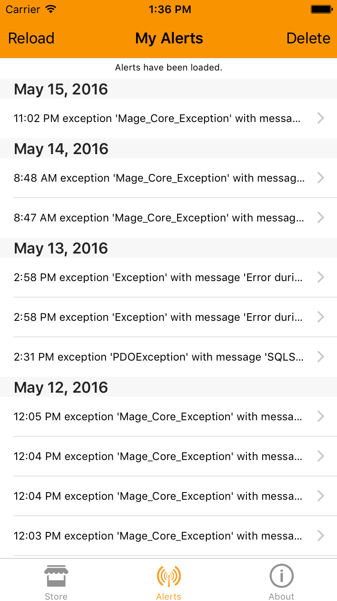

Store Alerts 
============
Receive notifications from your Magento website on your mobile device, email or Slack channel. 
Coming soon to the iOS App Store.

Description
-----------
  Our app alerts you to errors and other events on your website. 
When an error occurs on your website, it'll be logged for your review in your admin:

These errors and other alerts will be sent to your mobile device as alert Notifications. 
Also supported are email alerts and Slack channel notifications.

Install our app on your iOS mobile device. Then log in to your website:

After you have successfully logged in to your website, you can set your preferences 
for the type of alerts you would like to receive:

As you start to receive alerts, you can also view a list of alerts in the app:

How to Install
--------------
The iOS app is available now on the 
<a href="https://itunes.apple.com/us/app/extensions-store/id1115830392?ls=1&mt=8">iTunes</a> and the App Store. 
The Magento extension is available now in beta.

Modman:

<pre>
modman clone https://github.com/ExtensionsStore/StoreAlerts.git
</pre>

Composer:

<pre>
{
    "require": {
        "magento-hackathon/magento-composer-installer": "dev-master",
    	"extensions-store/store-alerts" : "1.0"
    },
    "repositories" : [
    	{
    		"type" : "vcs",
    		"url" : "https://github.com/ExtensionsStore/StoreAlerts.git"
    	}  	
    ],
    "extra": {
        "magento-root-dir": "./html",
        "magento-deploystrategy": "copy",
        "magento-force" : true,
        "with-bootstrap-patch" : false
    }
}

</pre>
